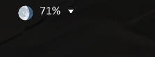

# GobbieBars

GobbieBars is a bar-based UI addon for Final Fantasy XI on Ashita v4.

It was made specifically for **CatseyeXI**, but it is designed to work on other Ashita v4 servers as well.

GobbieBars gives you configurable screen bars for information plugins and layout areas, while the built-in **Buttons** plugin can create shortcuts either on bars or directly on the screen. Each bar can be configured individually, including size, color, opacity, texture, and whether it stays visible or only appears when you move the mouse over it.

The **Buttons** plugin is built into GobbieBars and provides the main action button system. Other plugins can be enabled or disabled depending on what you want to show.

## Main Features

- Made specifically for CatseyeXI
- Designed to work on other Ashita v4 servers as well
- Configurable top, bottom, left, and right screen bars
- Each bar can be adjusted separately
- Bars can be static or shown only on mouseover
- In-game settings window
- Custom bar textures
- Custom fonts
- Support for different layouts/game modes
- Built-in Buttons plugin
- Optional plugins that can be turned on or off
- Plugin system for adding more features later

## Plugins

GobbieBars includes the built-in Buttons plugin and several optional plugins that can be enabled or disabled from the settings window.

| Plugin | Short Description |
|---|---|
| [Buttons](#buttons) | Create action buttons, macros, shortcuts, and custom commands. |
| [Clock](#clock) | Show Vana'diel time, real time, alarms, and clock icons. |
| [Codex](#codex) | Track missing spells or lookup entries with wiki support. |
| [Day](#day) | Show Vana'diel day and elemental weakness information. |
| [Emote](#emote) | Show a configurable emote menu. |
| [Moon](#moon) | Show moon phase information. |
| [Player Job](#player-job) | Show player jobs, levels, XP/LP, and job icons. |
| [Position](#position) | Show player position coordinates. |
| [Weather](#weather) | Show weather information with icon/text options. |

## Plugin Details

### Buttons

The Buttons plugin is built into GobbieBars and provides the main action button system.

Buttons can be attached to GobbieBars screen bars or placed freely on the screen. You can create shortcuts for commands, macros, items, spells, weaponskills, job abilities, trusts, mounts, and other custom actions.

Main options include custom icons, labels, tooltips, keybinds, multiline macros, job-specific visibility, text styling, colors, and drag-and-drop layout positioning.


### Clock

The Clock plugin displays Vana'diel time, real time, or both.

It supports seconds display, Vana'diel and real-time icons, font settings, alarm text, alarm mode, repeat timing, alarm sound testing, and an optional alarm overlay when the alarm fires.


### Codex

The Codex plugin provides a lookup/tracking window for missing spells or other useful entries.

It includes refresh support, a missing count display, selectable wiki source, label display options, list display options, and separate font settings for the label and list.


### Day

The Day plugin displays Vana'diel day information.

It can show the current day, weakness element, weakness text, and a next-day tooltip. Font and icon size can be configured.


### Emote

The Emote plugin provides a configurable on-screen emote menu.

It supports position and size settings, icon size, font size, bar text size, and individual emote options such as use, silent, and favorite.


### Moon

The Moon plugin displays moon phase information.

It can show the moon phase percentage and supports configurable font, font size, and icon size.



### Player Job

The Player Job plugin displays player job information.

It can show job name, main/sub job levels, XP/LP, percentages, prestige options, job icons, icon themes, sorting, font settings, and layout size controls.


### Position

The Position plugin displays player position coordinates.

It supports configurable precision, font, font size, font color, and placement on the screen or a bar.


### Weather

The Weather plugin displays weather information.

It supports optional text display, configurable font, font size, font color, icon size, and placement on the screen or a bar.


## Help

GobbieBars includes an in-game help window with detailed information about settings, buttons, plugins, and usage.

Basic install:

1. Download GobbieBars.
2. Place the `gobbiebars` folder in your Ashita `addons` folder.
3. Load it with:

```text
/addon load gobbiebars

## License

GobbieBars is released under the MIT License.
