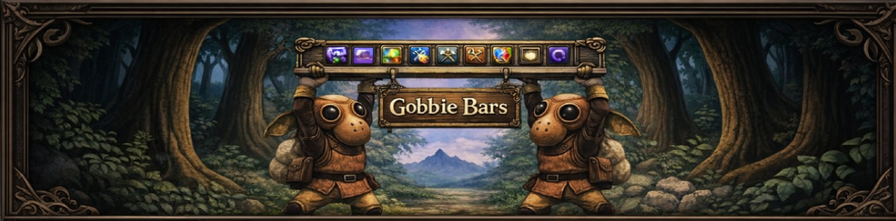

# GobbieBars

GobbieBars is a bar-based UI addon for Final Fantasy XI on Ashita v4.

It was made specifically for **CatseyeXI**, but it is designed to work on other Ashita v4 servers as well.

GobbieBars gives you configurable screen bars for information plugins and layout areas, while the built-in **Buttons** plugin can create shortcuts either on bars or directly on the screen. Each bar can be configured individually, including size, color, opacity, texture, and whether it stays visible or only appears when you move the mouse over it.

The **Buttons** plugin is built into GobbieBars and provides the main action button system. Other "gobbie" plugins can be enabled or disabled depending on what you want to show.

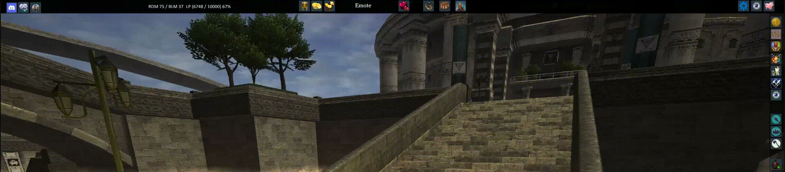

## Main Features

- Made specifically for CatseyeXI, with support for CW, ACE, and WEW game modes
- Designed to work on other Ashita v4 clients as well
- Configurable top, bottom, left, and right bars
- Each bar can be adjusted separately
- Settings to stay visible or appear only on mouseover
- In-game settings window
- Texture, size, color, opacity, and font settings
- Support for different layouts/game modes
- Built-in Buttons plugin
- Optional plugins that can be turned on or off
- Flexible plugin system so users can create their own plugins and load them into the GobbieBars framework

## Gobbie Plugins

GobbieBars includes the built-in Buttons plugin and several optional plugins that can be enabled or disabled from the settings window.

I wanted GobbieBars to be modular so I made separate plugins which can be added under the file structure of this addon, but they should not be confused with typical "Plugins" such as Minimap or Deeps which are installed in the "Ashita\Plugins" folder.

| Plugin | Short Description |
|---|---|
| [Buttons](#buttons) | Create action buttons, macros, shortcuts, and custom commands. |
| [Clock](#clock) | Display Vana'diel time, real time, alarms, and clock icons. |
| [Codex](#codex) | Track missing spells for your current job with clickable wiki links. |
| [Day](#day) | Display Vana'diel day and elemental weakness information. |
| [Emote](#emote) | Build a clickable emote list with silent and favorite options. |
| [Moon](#moon) | Display moon phase information. |
| [Player Job](#player-job) | Track player jobs, levels, XP/LP, and job icons. |
| [Position](#position) | Display player position coordinates, useful for Chocobo digging. |
| [Weather](#weather) | Display weather information with icon and text options. |

## Plugin Details

<h2>
  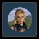
  Buttons
</h2>

The Buttons plugin is built into GobbieBars and lets you create fully configurable action buttons for your UI.

Buttons can be attached to GobbieBars bars or placed freely on the screen. You can create shortcuts for commands, macros, items, spells, weaponskills, job abilities, trusts, mounts, and other custom actions.

Buttons includes built-in support for CatseyeXI commands, inventory items, current-job spells, weapon-specific weaponskills, job abilities, available trusts, and available mounts. It can build selection lists from your current character data, so you do not need to manually type everything.

You can also browse locally for your own button images with one click, then use those images as custom icons.

Button display can be customized globally or per button, including icon size, background color, border color, hover color, click color, label position, cooldown text position, counter position, and keybind text position.

Text display can also be customized for labels, cooldowns, counters, keybinds, and tooltips, including font size, shadow size, text color, and shadow color.

Weaponskill buttons can highlight available skillchain elements, with configurable element icons, highlight effect, and highlight color.

Main options include custom icons, labels, tooltips, keybinds, multiline macros, job-specific visibility, text styling, colors, skillchain highlighting, and drag-and-drop layout positioning.

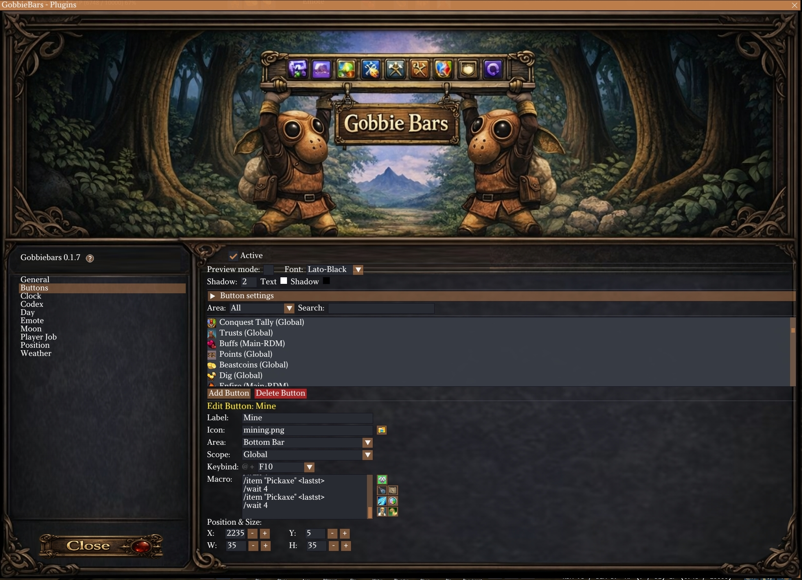

<h2>
  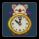
  Clock
</h2>

The Clock plugin shows Vana'diel time, real time, or both in a configurable display.

It includes customizable clock icons, font, font size, font color, and an alarm system with repeat timing, alarm sound settings, and an optional on-screen alarm overlay.

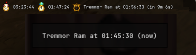

<h2>
  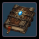
  Codex
</h2>

The Codex plugin tracks missing spells for your current job and displays them in a clickable list.

You can click any listed spell to open its wiki or Fandom page. It includes refresh support, missing spell count, selectable wiki source, display options, and configurable font settings.

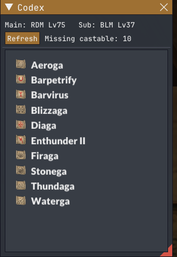

<h2>
  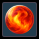
  Day
</h2>

The Day plugin displays Vana'diel day information.

It can show the current day, weakness element, weakness text, and a next-day tooltip. Font and icon size can be configured.


<h2>
  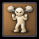
  Emote
</h2>

The Emote plugin lets you create your own clickable emote list.

You can add any emote to the list and configure each selected emote individually, including whether it should be used silently or added to your favorites. The display also supports position, size, icon size, font size, and bar text size settings.

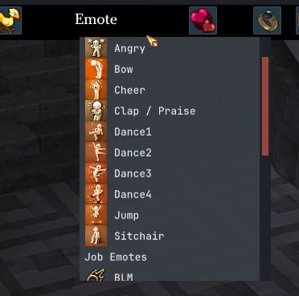

<h2>
  
  Moon
</h2>

The Moon plugin displays moon phase information.

It can show the moon phase percentage and supports configurable font, font size, and icon size.

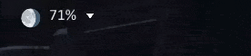

<h2>
  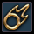
  Player Job
</h2>

The Player Job plugin displays player job information.

It can show job name, main/sub job levels, XP/LP, percentages, prestige options, job icons, icon themes, sorting, font settings, and layout size controls.

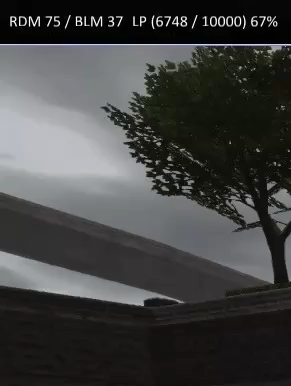

<h2>
  
  Position
</h2>

The Position plugin displays your current player position coordinates, which is especially useful for Chocobo digging.

It supports configurable precision, font, font size, font color, and placement on the screen or a bar.


<h2>
  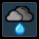
  Weather
</h2>

The Weather plugin displays weather information.

It supports optional text display, configurable font, font size, font color, icon size, and placement on the screen or a bar.

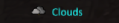

## Help

GobbieBars includes an in-game help window with detailed information about settings, buttons, plugins, and usage.

Basic install:

1. Download GobbieBars.
2. Place the `gobbiebars` folder in your Ashita `addons` folder.
3. Load it with:

```text
/addon load gobbiebars
```

## Project Status

GobbieBars is a project I am actively building and improving.

Everything included should be usable, but it is not finished yet. Some features may still need polish, and a few functions, icons, assets, or small details may still be missing while I continue working on it.

I am sharing it because I think it is already useful, but please keep in mind that it is still growing and changing.

Suggestions, feedback, and ideas are welcome.

## License

GobbieBars is released under the MIT License.
