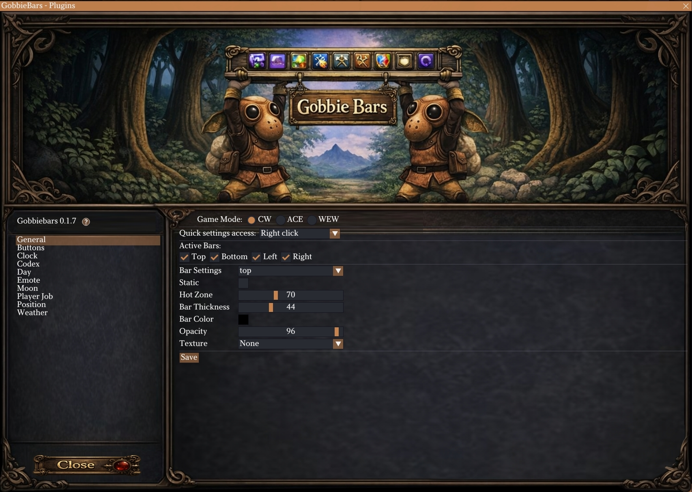

# GobbieBars

GobbieBars is a bar-based UI addon for Final Fantasy XI on Ashita v4, made specifically for CatseyeXI but designed to work on other Ashita v4 servers as well.

It lets you place configurable bars on your screen and attach plugins to those bars. Each bar can be configured separately, including size, color, opacity, texture, and whether it stays visible or only appears when you move the mouse over it.

The first included plugin is **Buttons**, a configurable action bar system for commands, macros, items, spells, weaponskills, job abilities, trusts, mounts, and other shortcuts.

## Highlights

- Made for CatseyeXI, with expected compatibility on other Ashita v4 servers
- Create top, bottom, left, and right screen bars
- Configure each bar individually
- Set each bar to stay visible or show only on mouseover
- Enable or disable each bar separately
- Adjust bar size, color, opacity, texture, and hover area
- Configure settings in-game through the GobbieBars UI
- Use different layouts for supported game modes
- Add, remove, enable, and disable plugins from inside GobbieBars
- Ships with the Buttons plugin
- Supports custom bar textures and custom fonts
- Includes a plugin template for users who want to create their own plugins

## Buttons Plugin

The Buttons plugin is included with GobbieBars and provides configurable action buttons.

With Buttons, you can create clickable shortcuts for commands, macros, items, spells, weaponskills, job abilities, trusts, mounts, and custom actions.

### Buttons Plugin Highlights

- Add, edit, duplicate, and delete buttons
- Place buttons on different bars
- Set button icons, labels, tooltips, counters, and keybinds
- Create multi-line macros by chaining commands in one button
- Use global buttons or job-specific buttons
- Set visibility by main job or sub job
- Configure text size, color, alignment, and shadow
- Customize icon, border, background, and state colors
- Use included icons or your own `.png` files
- Supports drag-and-drop positioning in layout mode

## Screenshots

### General Settings

### Buttons Plugin

## Documentation

Detailed documentation will be added as the addon is prepared for public release.

Planned pages:

- Installation guide
- Configuration guide
- Buttons plugin guide
- Plugin development guide

## License

GobbieBars is released under the MIT License.
